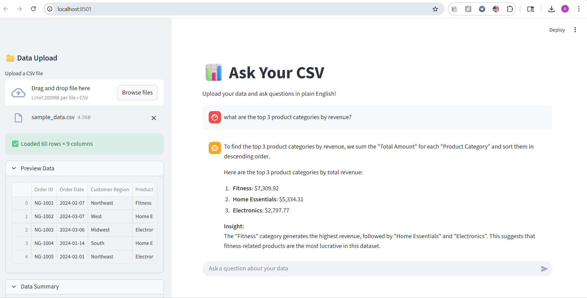
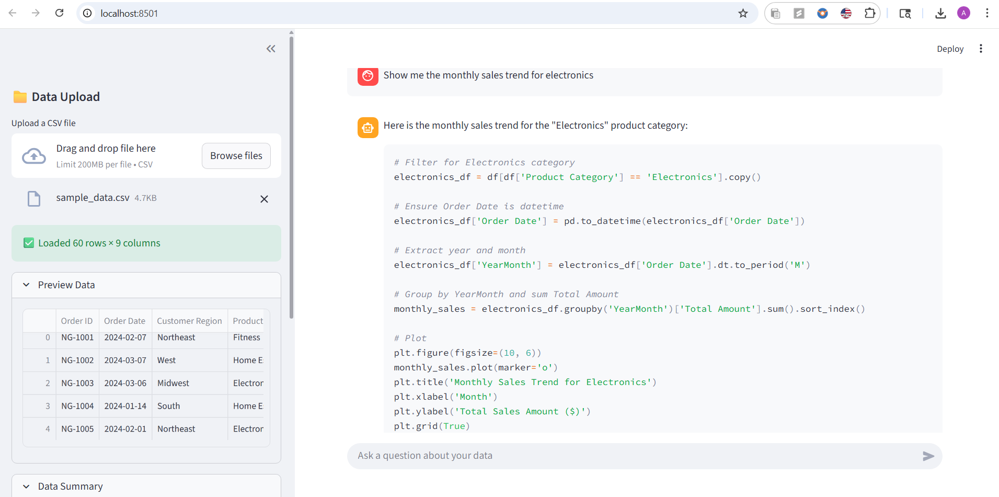
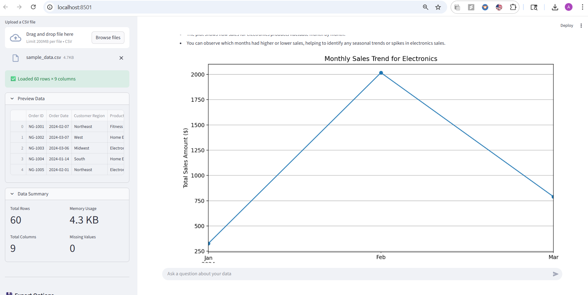
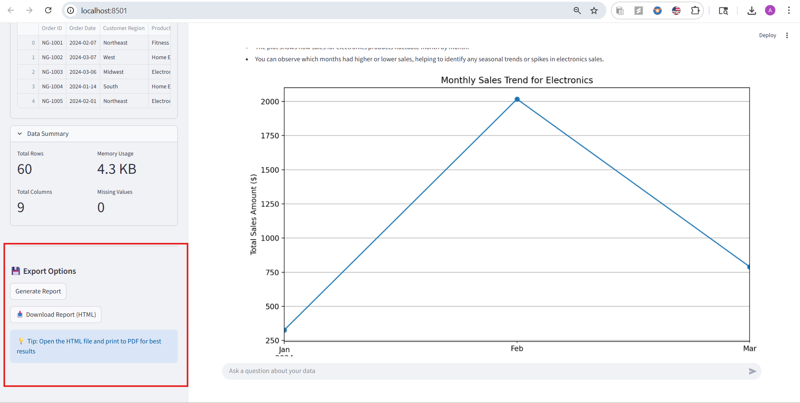

# 📊  Gen AI & LLM-Powered Data Analysis Assistant App

An interactive **Streamlit + OpenAI** app that lets you upload a CSV file and ask questions about your data in plain English.  
The app uses the **OpenAI GPT-4.1** model to analyze your dataset, write Python or SQL-like code, execute it, and return summaries, statistics, and visualizations - all within a chat interface.

---

## 🚀 Features

✅ Upload any CSV file and explore it instantly  
✅ Ask data questions in **plain English** (no coding required)  
✅ Get answers, charts, and insights generated automatically  
✅ Built-in export option to download your conversation as an HTML report  
✅ Uses **pandas**, **matplotlib**, and **seaborn** for visualization  
✅ Maintains chat history and session state for continuous analysis  

---

## 🧩 Tech Stack

- [Python 3.9 +](https://www.python.org/)
- [Streamlit](https://streamlit.io/)
- [OpenAI Python SDK (v1)](https://github.com/openai/openai-python)
- [Pandas](https://pandas.pydata.org/)
- [Matplotlib](https://matplotlib.org/)
- [Seaborn](https://seaborn.pydata.org/)

---

## ⚙️ Installation Guide

### 1️⃣ Clone the Repository
```bash
git clone https://github.com/anupbpote02/data_analysis_llm.git
cd data_analysis_llm
```

### 2️⃣ Create a Virtual Environment
```bash
python -m venv myenv
source myenv/Scripts/activate       # Windows (Git Bash / PowerShell)
# or
source myenv/bin/activate           # Mac / Linux
```

### 3️⃣ Install Dependencies
```bash
pip install -r requirements.txt
```

### ▶️ Run the App
```bash
python -m streamlit run app.py
```

Then open your browser and go to:
👉 http://localhost:8501


---

## 🖼️ App Screenshots

### 1️⃣ Upload CSV and Preview Data


### 2️⃣ Ask Questions in Plain English


### 3️⃣ Auto-Generated Python Code and Visualization


### 4️⃣ Export Your Conversation as a Report

